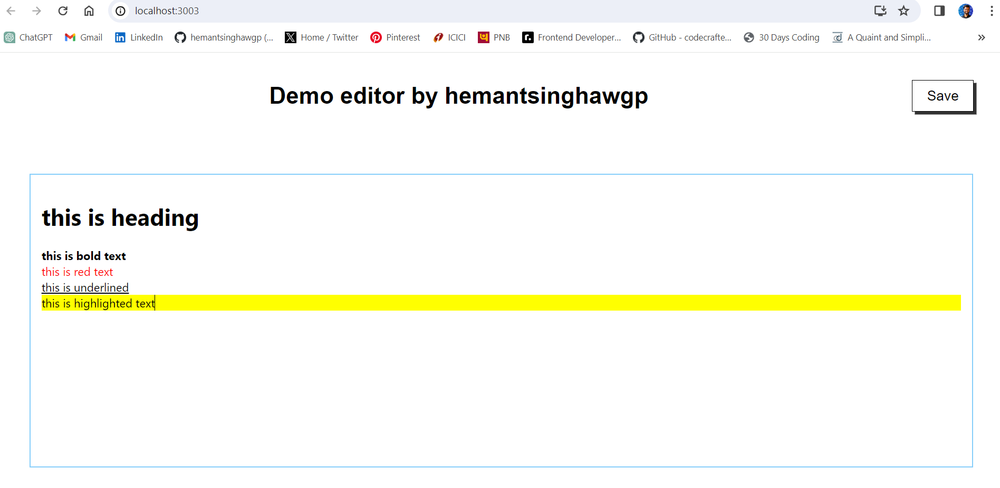

# Draft.js Text Editor

This is a simple text editor built using Draft.js within ReactJS. It allows users to create and edit text with various formatting options such as headings, bold, italic, underline, and highlighted text.



## Features

- Users can format text using Markdown-like syntax:
  - Typing `#` as the first string in a line & pressing space makes the text a Heading 1.
  - Typing `*` as the first string in a line & pressing space makes the text bold.
  - Typing `**` as the first string in a line & pressing space makes the text red.
  - Typing `***` as the first string in a line & pressing space makes the text underline.
  - Typing `` ``` `` and pressing space creates highlighted text.
- Users can save their work to local storage and retrieve it upon revisiting the page.

## Getting Started

To run this project locally, follow these steps:

1. Clone this repository to your local machine.
2. Navigate to the project directory in your terminal.
3. Install dependencies using `npm install`.
4. Start the development server using `npm start`.
5. Open your browser and go to `http://localhost:3000` to view the app.

## Technologies Used

- ReactJS
- Draft.js
- HTML/CSS

## Contributing

Contributions are welcome! Feel free to open an issue or submit a pull request.

## License

This project is licensed under the MIT License - see the [LICENSE](LICENSE) file for details.
